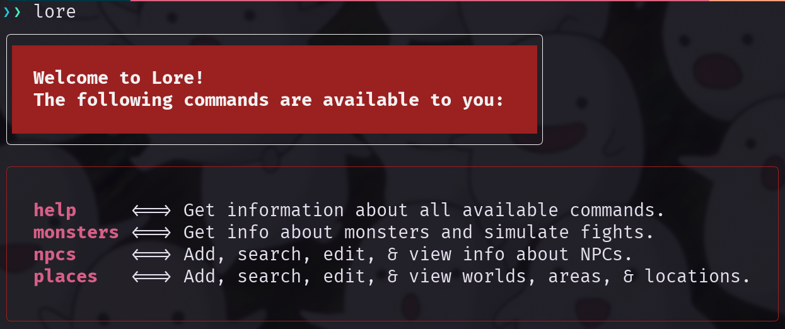

# Lore
A CLI tool for game masters running D&D, Pathfinder, and other tabletop game
campaigns. All written in Go. While I still largely run a pen & paper campaign,
I always keep a laptop up and running for looking up info and keeping notes.

Currently a work in progress, but still functional!



## Installing Lore

Prerequisites:
- Go
- SQLite3

Install the Go toolchain [via the docs](https://go.dev/doc/install) or [via webi](https://webinstall.dev/golang/)!

Install SQLite3 via your necessary method!

For example:
```bash
# Ubuntu
sudo apt update && sudo apt upgrade && sudo apt install sqlite3

# Arch
sudo pacman -Syu && sudo pacman -S sqlite:

# Mac
brew install sqlite3
```

Now simply install Lore via the Go toolchain:
```bash
go install github.com/jake-abed/lore
```

## Commands

### **help**
Lists all available commands

### **dice**
- **-a <dice-expression>** | Rolls a dice expression and returns the result summed up.
- **-i <dice-expression>** | Rolls a dice expression, printing each roll individually, then summing it up.
#### Examples of Dice Expressions
> d20, 1d6, 2d12+1, 1d4-1, 3d6+8, 5d20+12, 80d100-50, etc. 

### **monsters**
- **-i <monster name or id>**    | Get basic information about a monster from the D&D 5e API.
- **-f <monster-1> <monster-2>** | Simulate a turn-based fight between two monsters.
- - Slightly skewed as it does not factor movement or flying into the battles, so extremely agile or flying monsters will have less of an edge than they normal would.

### **npcs**
View, search, edit, and create custom NPCs for your campaign.

- **-a**        | Add new NPC via form!
- **-v <name>** | View an NPC with the provided name (exact match).
- **-s <name>** | Lists all NPCs that partially match the provided name.
- **-e <name>** | Edit an NPC with the provided name (exact match).

### **places**
View, search, edit, and create custom places for your campaign.
- **<place-flag> -a**         | Add a new place via form!
- **<place-flag> -d** <id>    | Delete a place by ID represented as an integer.
- **<place-flag > -v <name>** | View a place with the provided name (exact match).
- **<place-flag> -s <name>**  | Lists all places that partially match the provided name.
- **<place-flag> -e <name>**  | Edit a place with the provided name (exact match).

#### Uses 'place flags' to mark which place type you are operating on.
- --world       | Overaching world for a campaign.
- --area        | Areas or regions of a world.
- --location    | Locations contained within areas.
- --sublocation | Not implemented! Not sure if necessary or overkill?

## Roadmap

While not set in stone, hitting a true v1.0.0 will include:
- [x] ~~Dice Rolls~~
- - ~~`lore dice <dice-arg>` allowing for dynamic dice rolls!~~
- - - ~~For example `lore dice 2d6+1` rolls two six-sided die and adds one!~~
- [ ] Quests
- - [x] ~~Write quests.~~
- - [ ] Attach NPCs to quests
- - [ ] Attach places to quests?
- [ ] History/Events
- - The final shape isn't decided, but historical events can be important.
- [ ] Players
- - Store info about your player's characters.
- [ ] Encounters
- - Write encounters and then serve them up randomly to the GM.

I'm also debating adding a custom monsters section or replacing the API with custom monsters. The catch here is that monsters are... complex and require significantly more work to customize. They also require knowledge of the game system being used. Lore is supposed to be game system agnostic for custom info. So, feedback would be nice here.

### NB on Compatibility

Up until v1.0.0 Lore should be considered unstable. The shape of the DB is a work in progress and I cannot promise compatibility.

Starting at v1.0.0, the DB schema will be stable and non-breaking changes only will happen.

## Contributing

Want to contribute to Lore at all?

### Clone the repo:
```bash
git clone https://github.com/jake-abed/lore
cd lore
```

### Build it:
```bash
go build
```

### Submit a pull request!

If you want to contribute anything at all, please fork the repository
and open up a pull request to the 'main' branch.
